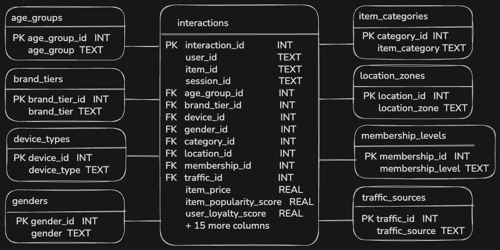

# Project 1 SQL | E-Commerce Intelligence: From Data to Insight 

*Data Science & Machine Learning — Week 3*

**Project 1 — SQL: From Data to Insight**
Data Science & Machine Learning, Week 3

An ETL pipeline that takes a raw e-commerce interactions dataset, normalizes it into a relational (star-schema) database, analyzes it with SQL, and turns the results into a data-driven story about what actually predicts a purchase.

---

## 1. Project Overview 

**Business objective:** A merchandising team is interested in investigating where to prioritize investing in, demographics or tier-based targeting, which product categories and channels drive conversion, what product features predict a customer's purchase, and what drives returns.

The pipeline follows a full ETL workflow:
**Extract** (raw CSV) → **Transform** (clean & normalize in pandas) → **Load** (star-schema SQLite database) → **Query** (SQL analysis) → **Report** (notebook with visualizations and a written data story).


## 2. Research Questions

|  | Research Question | Variables |
|---|---|---|
| RQ1 | Does who the customer is predict purchase? | `Age_Group`, `Gender`, `Membership_Level`, `Location_Zone` |
| RQ2 | Does where and how they shop predict purchase? | `Item_Category`, `Brand_Tier`, `Device_Type`, `Traffic_Source` |
| RQ3 | What does predict purchase? | `Wishlist_Flag`, `User_Loyalty_Score`, `Item_Popularity_Score`, `Item_Quality_Score`, `Cart_Add_Count` |
| RQ4 | Among purchases, what predicts a return? | `Item_Quality_Score`, `Rating`, `Item_Category`, `Discount_Percentage`, `Item_Price` |


## 3. The Dataset

- **Source:** [E-Commerce Intelligence Data](https://www.kaggle.com/datasets/colabsss/e-commerce-intelligence-data/data?select=Ecommerce_Recommendation_Dataset.csv) by Kaggle user `colabsss`
- **File:** `Ecommerce_Recommendation_Dataset.csv`
- **Size:** 12,000 rows × 47 columns raw. 30 columns retained after dropping 17 out-of-scope recommender-system output columns (e.g. `Embedding_Similarity_Score`, `Q_Value_Score`, `Candidate_Rank`, `Final_Recommendation_Score`) that are algorithm outputs, not shopper or product attributes. One `interaction_id` primary key is added during processing, bringing the final fact table to 31 columns.
- **Grain:** one row = one user–item interaction (a view/click/purchase event in a session)
- **Data quality:** verified in notebook 01 — zero missing values across all 47 columns, zero full duplicate rows, zero blank/whitespace-only values.
- **Note on the daset:** this dataset is likely synthetically generated rather than collected from a live platform. Because of that, the specific numbers and correlations below should be read as a demonstration of methodology (relational design, hypothesis testing, data storytelling) rather than real-world market findings.


## 4. Database Design 


A **star schema** was used instead of a single denormalized table. This was a deliberate choice as `User_ID` and `Item_ID` in this dataset do not map to a single fixed set of attributes (the same user_id can show up with different age, membership etc.). 

The schema consists of:

- **1 fact table** — `interactions` (31 columns: 4 identifiers, 8 foreign keys, 19 behavioral/numeric measures)
- **8 lookup tables** — `age_groups`, `genders`, `membership_levels`, `location_zones`, `item_categories`, `brand_tiers`, `device_types`, `traffic_sources`

Each lookup table has an integer primary key and one descriptive text column and the `interactions` table references all 8 via foreign keys. See ERD below.


*`interactions` (center) is the fact table, 4 lookup tables sit on each side. One-to-many relationship: one lookup row relates to many interaction rows.*

**Referential integrity** validated at two points:
- **Pre-load:** checked for unmatched keys after merging lookup IDs into the fact table (`0 unmatched` confirmed on all 8 keys)
- **Post-load:** row counts and a sample `JOIN` query checked against the database after loading


## 5. Repository Structure

```
project-1-eda/
│
├── data/
│   ├── raw/
│   │   └── Ecommerce_Recommendation_Dataset.csv   # original Kaggle dataset
│   ├── clean/
│   │   ├── interactions.csv                       # fact table, ready to load
│   │   ├── age_groups.csv                         # 8 lookup tables
│   │   ├── genders.csv
│   │   ├── membership_levels.csv
│   │   ├── location_zones.csv
│   │   ├── item_categories.csv
│   │   ├── brand_tiers.csv
│   │   ├── device_types.csv
│   │   └── traffic_sources.csv
│   └── project.db                                 # SQLite database (loaded from data/clean/)
│
├── sql/
│   ├── schema.sql                                 # CREATE TABLE statements (star schema)
│   ├── queries.sql                                # SQL Queries answering the 5 questions   
│
├── src/
│   └── functions.py                                # reusable functions (cleaning, lookups, queries, stats)
│
├── notebooks/
│   ├── 01_eda.ipynb                               # exploratory data analysis, data quality, RQs
│   ├── 02_processing.ipynb                        # cleaning, table design, loading, FK validation
│   └── 03_hypothesis_and_visualization.ipynb      # report: queries, charts, findings
│
├── ERD.png                                        # entity-relationship diagram
└── README.md
```


## 6. SQL Analysis

Eight queries, written inline in `03_hypothesis_and_visualization.ipynb`, run against `data/project.db`:

| Query | Technique | Purpose |
|---|---|---|
| Q1 | `JOIN` + `GROUP BY` | Conversion rate by membership level |
| Q2 | `JOIN` + `GROUP BY` + `HAVING` | Conversion rate by item category (categories with >500 interactions) |
| Q3 | `CASE` + `GROUP BY` | Conversion rate by wishlist status |
| Q4 | `CASE` + `GROUP BY` | Conversion rate by user loyalty-score (Low/Medium/High) |
| Q5 | `WHERE`+ `CASE` + `GROUP BY` | Return rate by item-quality, for purchased items|
| Q6 | `JOIN` + `HAVING` | Categories whose conversion rate beats the overall average |
| Q7 | `JOIN` + `ORDER BY` + `LIMIT` | Category with the highest return rate |
| Q8 | `JOIN` + `WHERE` + `ORDER BY` + `LIMIT` | Age group with the most purchases that were not returned |


## 7. Key Findings

| RQ | Question | Verdict | Key evidence |
|---|---|---|---|
| RQ1 | Does who the customer is predict purchase? | **No** | All four variables (age, gender, tier, location): Cramer's V ≤ 0.025, very weak association |
| RQ2 | Does where and how they shop predict purchase? | **No** | All four variables (category, brand tier, device, traffic source): Cramer's V ≤ 0.025, very weak association |
| RQ3 | What does predict purchase? | **Yes** | All five variables (cart add count, rating, quality, popularity, loyalty score) have high association. Wishlist and Loaylty score have the strongest monotonic relationship. |
| RQ4 | What predicts a return? | **Partially** | All four variables (rating, quality, discount, price) don't show very strong association. Quality is the only varibale that has higher association with returns than the rest. |

**The story:** it's not *who* the customer is or *where* they shop that predicts purchase, rather *what they do* (wishlisting, engagement) and *how loyal they already are*. A merchandising or marketing team working from this data should deprioritize demographic segmentation and channel-specific campaigns, and instead focus on intent-based triggers like wishlist reminders emails, push notificatications, price-drop alerts, and loyalty-tier nurturing. On the product side, quality has a real but modest relationship to returns. Something worth monitoring, but not the dominant driver.


## 8. Limitations and Next Steps

**Limitations:** This is likely a synthetic dataset, so absolute numbers (37% baseline conversion, price ranges) are not real-world benchmarks. The relationships found (wishlist and loyalty as top predictors, demographics and channel as non-predictors) are the deliverables and they demonstrate the analysis method. However, they are not a claim about real shopper behavior.

With more time, it would be worth exploring the relationship between stock availability and purchases (as some categories may be out of stock more often, lowering conversion) and the relationship between click count, engagement score, and loyalty score together, for a better and fuller picture of shopping behavior.


## 9. Author

Jovana Krstevska